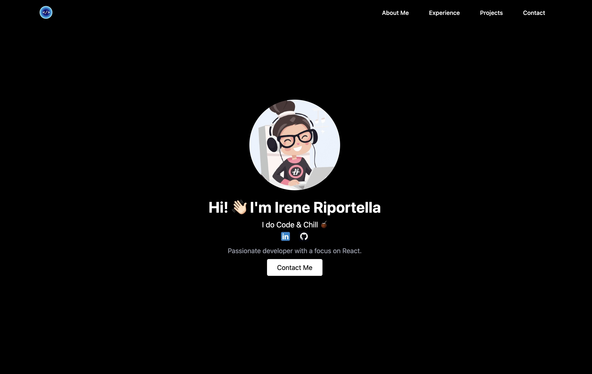

# 🚀 Irene Riportella - Portfolio Website

Welcome to my **personal portfolio website**! 🎨💻  
This website showcases my **web development skills, experience, and projects** in a modern, interactive, and fully responsive design.

🌍 **Live Demo:** [ireneriportella.com](https://www.ireneriportella.com/)

---

## **📸 Preview**

---

## **✨ Features**

✅ **Smooth Navigation** – Effortlessly scroll through different sections.  
✅ **Modern Dark-Themed UI** – Clean, stylish, and visually appealing.  
✅ **Fully Responsive Design** – Optimized for **mobile, tablet, and desktop**.  
✅ **Interactive Contact Form** – Get in touch directly via **EmailJS**.  
✅ **Project Showcase** – Displays featured projects dynamically.  
✅ **Social Media Integration** – Quick access to my **GitHub & LinkedIn**.  
✅ **SEO Optimized** – Structured with proper metadata for discoverability.  
✅ **Performance Optimized** – Lighthouse-tested for speed & accessibility.

---

## **🛠️ Technologies Used**

🚀 **Frontend:**

- **React.js + Vite** (Fast and modern development)
- **Tailwind CSS** (Utility-first styling for a sleek UI)
- **JavaScript (ES6+)**

📩 **Contact Form Integration:**

- **EmailJS** (Enables form submissions without a backend)

🌍 **Deployment:**

- **Vercel**

---

## **📨 Contact Me**

📧 **Email:** riportellairene@gmail.com  
🔗 **Website:** [ireneriportella.com](https://www.ireneriportella.com/)  
💼 **LinkedIn:** [linkedin.com/in/irene-riportella-0992893](https://www.linkedin.com/in/irene-riportella-0992893/)  
🐙 **GitHub:** [github.com/Ireneripo](https://github.com/Ireneripo)

📩 **I’m open to opportunities, collaborations, and new challenges!**

---

⭐ **If you like this portfolio, consider sharing it or connecting with me!** ⭐
